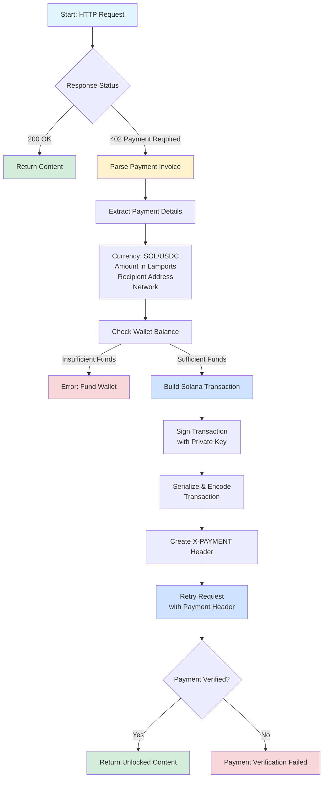
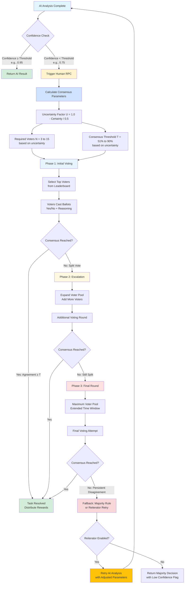

# x402-solana

x402-solana is an Autonomous Payment Agent SDK designed for seamless integration of the x402 protocol with Solana blockchain applications. It automates handling HTTP 402 "Payment Required" responses by initiating Solana payments (SOL or USDC), enabling access to paywalled content.

---

## Features

- **Automatic Payment Handling**: Handles HTTP 402 responses with Solana-based payments.
- **Dual Currency Support**: Supports both SOL native token payments and SPL token (like USDC) payments.
- **Seamless Integration**: Easily integrates with Solana wallets and RPC networking.
- **Dev-Friendly Utility Functions**:
  - Transaction Building: Easily construct and sign SOL and token transactions.
  - Verification Mechanisms: Verify payment headers and processed transactions.
- **Extendable SDK**: Customizable for a variety of Solana-based app requirements.

---

## How It Works

### Autonomous Payment Workflow

The x402-solana SDK implements an intelligent autonomous payment system that seamlessly handles paywalled content with confidence-based decision making:



**Workflow Steps:**

1. **Request**: You make a normal HTTP request using `agent.get()` or `agent.post()`
2. **402 Detection**: If the server responds with `402 Payment Required`, the SDK automatically:
   - Parses the payment invoice from the response
   - Extracts payment details (currency, amount, recipient, network)
   - Validates wallet balance for sufficient funds
   - Builds a Solana transaction (SOL or USDC)
   - Signs and encodes the transaction with your private key
   - Creates the `X-PAYMENT` header with serialized transaction
   - Retries the request automatically with payment proof
3. **Verification**: The server verifies the payment transaction
4. **Success**: Your request completes with the unlocked content

### Consensus-Based Task Resolution with Human RPC

When AI confidence falls below a threshold, the SDK leverages Human RPC for consensus-based verification through a sophisticated multi-phase voting system:



**Consensus Workflow Details:**

1. **Confidence Evaluation**: After AI analysis, confidence is compared against threshold (default 0.9)

2. **Dynamic Parameter Calculation**:
   - **Uncertainty Factor (U)**: Measures AI's uncertainty level (0.0 = certain, 1.0 = uncertain)
   - **Required Voters (N)**: Scales from 3 voters (high certainty) to 15 voters (low certainty)
   - **Consensus Threshold (T)**: Scales from 51% (simple majority) to 90% (super-majority)

3. **Multi-Phase Voting System**:
   - **Phase 1**: Initial round with minimal voters based on AI confidence
     - If consensus reached → Task resolved immediately
     - If split vote → Escalate to Phase 2
   
   - **Phase 2**: Expanded voter pool with additional participants
     - Brings in more diverse opinions
     - Higher stakes and scrutiny
     - If consensus reached → Task resolved
     - If still split → Escalate to Phase 3
   
   - **Phase 3**: Maximum voter pool with extended decision window
     - Last attempt at achieving consensus
     - Involves most experienced voters
     - If consensus reached → Task resolved with confidence
     - If persistent disagreement → Apply fallback mechanisms

4. **Fallback Mechanisms**:
   - **Majority Rule**: Use the majority decision despite lack of consensus threshold
   - **Reiterator System**: If enabled, automatically retries AI analysis with adjusted parameters
     - Implements exponential/linear backoff strategies
     - Maximum retry attempts configurable
     - Provides iterative improvement loop

5. **Reward Distribution**:
   - Consensus voters receive rewards from escrow
   - Dissenting voters may face accuracy penalties
   - Leaderboard rankings updated for future voter selection

---

## Getting Started

### Prerequisites

Ensure the following are set up in your environment:

- **Python 3.9 or Later**
- **Solana Wallet**: With an adequate balance of SOL and/or USDC.
- **Internet Connection**: For RPC calls to the Solana network.
- **Solana CLI** (Optional): For additional keypair and network configurations.

---

## Installation

1. Clone this repository:

   ```bash
   git clone https://github.com/Adarsh-Dhar/x402-solana.git
   cd x402-solana
   ```

2. Install dependencies:

   - For the SDK:
   
     ```bash
     pip install -r requirements.txt
     ```

   - For Node.js components:

     ```bash
     npm install
     ```

3. Configure Environment Variables:
   
   Add the following environment variables for your project:
   - `NEXT_PUBLIC_SOLANA_RPC_URL`: Specify Solana RPC URL.
   - `TREASURY_WALLET`: Specify the treasury's public key.

---

## Usage Instructions

### Python SDK Example

1. Import the module:

   ```python
   from human_rpc_sdk.solana_utils import create_payment_header
   ```

2. Build and process a transaction:

   ```python
   from solders.transaction import Transaction
   
   # Simulating a SOL Native Transaction:
   serialized_tx = "Base64_encoded_tx_here"
   payment_header = create_payment_header(serialized_tx, network="devnet")
   print(payment_header)
   ```

### API Integration Example

Use the backend's `processX402Payment` function to verify and execute transactions:

```typescript
import { processX402Payment } from "../app/api/v1/tasks/route"

// Initiates processing with existing header
const header = "<Serialized_X-PAYMENT_Header>";
const result = await processX402Payment(header, "SOL");
console.log(`Verified: ${result.verified}`);
```

---

## Testing the App

The repository includes test cases to validate key functionalities:

1. **Run Tests for SDK Components:**

   ```bash
   pytest main-app/sdk/tests/
   ```

2. **Backend API Tests:**

   To debug or simulate transactions, the backend integrates with test handlers.

---

## Key Files & Structure

- **`main-app/`**: Houses the primary implementation for the app.
  - **SDK**: Solana-specific utility modules.
  - **API**: Demos API for processing and integrating payments.
- **`test-agent/`**: SDK Test cases and example toolchains.
- **`LICENSE`**: Distributed under the MIT License.

---

## Troubleshooting

- **Connection Issues**: Verify Solana RPC endpoints are responsive.
- **Invalid Transactions**: Ensure serialized transactions comply with the Solana transaction format.
- **Simulation Failures**: Use `simulateTransaction` for Solana debug.

---

## Documentation

- [SDK User Guide](https://github.com/Adarsh-Dhar/x402-solana/INSTRUCTIONS.md)

---

## License

This project is licensed under the MIT License. See LICENSE file for details.

---

## Contributing

We encourage the community to contribute to this repository. Submit bugs, feedback or pull requests to enhance the capability of **x402-solana**.

---
