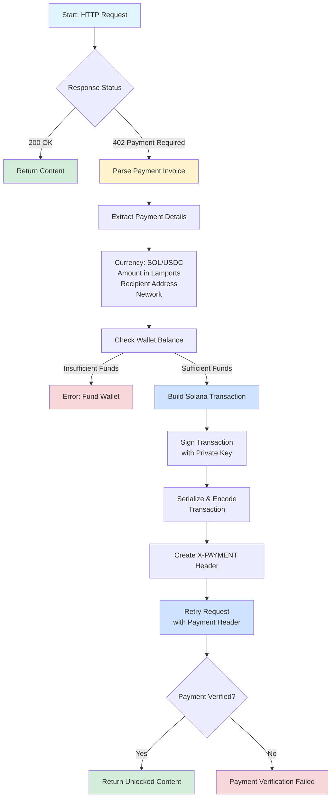
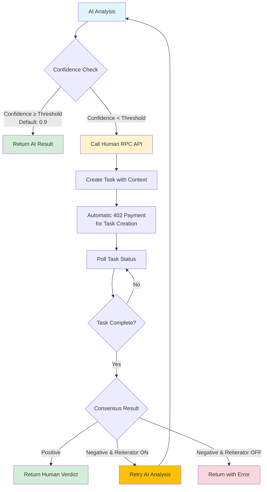

# Human RPC SDK

Autonomous Payment Agent SDK for Solana x402 protocol. Automatically handles 402 Payment Required responses by making Solana payments (SOL or USDC) to unlock paywalled content.

## Installation

```bash
pip install human-rpc-sdk
```

## How It Works

### Autonomous Payment Workflow

The SDK provides intelligent, automated payment handling for x402 protocol responses:



**Payment Flow:**

1. **Request**: You make a normal HTTP request using `agent.get()` or `agent.post()`
2. **402 Detection**: If the server responds with `402 Payment Required`, the SDK automatically:
   - Parses the payment invoice
   - Builds a Solana transaction (SOL or USDC)
   - Signs and encodes the transaction
   - Adds it to the `X-PAYMENT` header
   - Retries the request automatically
3. **Success**: Your request completes with the unlocked content

### Human RPC Integration with Confidence Thresholds

When AI confidence falls below a configurable threshold, the SDK can automatically request human verification:



**Confidence-Based Decision Flow:**

- **High Confidence (≥ threshold)**: AI result returned immediately without human verification
- **Low Confidence (< threshold)**: Human RPC automatically invoked for consensus validation
- **Reiterator Mode**: Optional automatic retry with adjusted parameters if consensus is negative
- **Integrated Analysis**: Seamlessly combines AI speed with human accuracy when needed

---

## Quickstart

### 1. Set Environment Variables

```bash
# Required: Your Solana private key (base58-encoded)
export SOLANA_PRIVATE_KEY="your_base58_private_key_here"

# Optional: Custom RPC URL (defaults to public Solana RPCs)
export SOLANA_RPC_URL="https://your-rpc-provider.com"
# Or network-specific:
export SOLANA_MAINNET_RPC_URL="https://mainnet.helius-rpc.com"
export SOLANA_DEVNET_RPC_URL="https://devnet.helius-rpc.com"

# Optional: Human RPC endpoint (defaults to localhost)
export HUMAN_RPC_URL="https://your-human-rpc-endpoint.com/api/v1/tasks"
```

### 2. Basic Usage

```python
from human_rpc_sdk import AutoAgent

# Initialize the agent
agent = AutoAgent()

# Make requests - payments are handled automatically!
response = agent.get("https://premium-api.com/data")
print(response.json())

# POST requests work too
response = agent.post(
    "https://api.example.com/endpoint",
    json={"query": "example"}
)
```

### 3. Human RPC Integration

```python
from human_rpc_sdk import AutoAgent

agent = AutoAgent()

# Ask Human RPC to analyze text
result = agent.ask_human_rpc(
    text="Analyze this sentiment",
    agentName="MyAgent",
    reward="0.3 USDC",
    rewardAmount=0.3,
    category="Analysis",
    escrowAmount="0.6 USDC",
    context={
        "type": "sentiment_check",
        "summary": "Validate sentiment classification",
        "data": {
            "userQuery": "What is the sentiment?",
            "agentConclusion": "POSITIVE",
            "confidence": 0.75,
            "reasoning": "The text contains positive indicators..."
        }
    }
)

print(f"Sentiment: {result['sentiment']}")
print(f"Confidence: {result['confidence']}")
```

### 4. Integrated Analysis (AI + Human RPC)

```python
from human_rpc_sdk import AutoAgent

agent = AutoAgent()

def my_ai_analysis(text: str) -> dict:
    # Your AI analysis logic here
    return {
        "userQuery": text,
        "agentConclusion": "POSITIVE",
        "confidence": 0.75,  # Low confidence triggers Human RPC
        "reasoning": "Analysis reasoning..."
    }

# Automatically uses Human RPC if confidence is below threshold
result = agent.integrated_analysis(
    text="Wow, great job team. Another delay. Bullish!",
    ai_analysis_callback=my_ai_analysis,
    confidence_threshold=0.99
)
```

## Configuration

### Environment Variables

| Variable | Required | Description | Default |
|----------|----------|------------|---------|
| `SOLANA_PRIVATE_KEY` | Yes | Base58-encoded Solana private key | - |
| `SOLANA_RPC_URL` | No | Global RPC URL override | Public Solana RPCs |
| `SOLANA_MAINNET_RPC_URL` | No | Mainnet-specific RPC URL | `https://api.mainnet-beta.solana.com` |
| `SOLANA_DEVNET_RPC_URL` | No | Devnet-specific RPC URL | `https://api.devnet.solana.com` |
| `HUMAN_RPC_URL` | No | Human RPC endpoint | `http://localhost:3000/api/v1/tasks` |

### RPC URL Priority

1. `SOLANA_RPC_URL` (global override)
2. Network-specific (`SOLANA_MAINNET_RPC_URL` or `SOLANA_DEVNET_RPC_URL`)
3. Default public RPC URLs

## How It Works

1. **Request**: You make a normal HTTP request using `agent.get()` or `agent.post()`
2. **402 Detection**: If the server responds with `402 Payment Required`, the SDK automatically:
   - Parses the payment invoice
   - Builds a Solana transaction (SOL or USDC)
   - Signs and encodes the transaction
   - Adds it to the `X-PAYMENT` header
   - Retries the request automatically
3. **Success**: Your request completes with the unlocked content

## Troubleshooting

### Insufficient Funds

**Error**: `Insufficient Funds. Please send SOL/USDC to <wallet_address>`

**Solution**: Fund your wallet with the required amount:
- For SOL payments: Send SOL to your wallet address
- For USDC payments: Send USDC to your wallet (it will be in an associated token account)

### RPC Rate Limits

**Error**: `RPC error: rate limit exceeded`

**Solution**: Use a private RPC provider:
```bash
export SOLANA_RPC_URL="https://your-private-rpc-provider.com"
```

### Invalid Private Key

**Error**: `Failed to load private key from SOLANA_PRIVATE_KEY`

**Solution**: Ensure your private key is:
- Base58-encoded
- A valid Solana keypair
- Set in the environment variable correctly

### Payment Verification Failed

**Error**: `Payment verification failed`

**Solution**: 
- Ensure your wallet has sufficient funds
- Check that the payment amount matches the invoice
- Verify the network (mainnet/devnet) matches the invoice

## Requirements

- Python 3.9+
- Solana wallet with SOL/USDC balance
- Internet connection for RPC calls

## License

MIT License - see LICENSE file for details.

## Support

For issues and questions:
- GitHub Issues: https://github.com/yourusername/x402-solana/issues
- Documentation: https://github.com/yourusername/x402-solana

